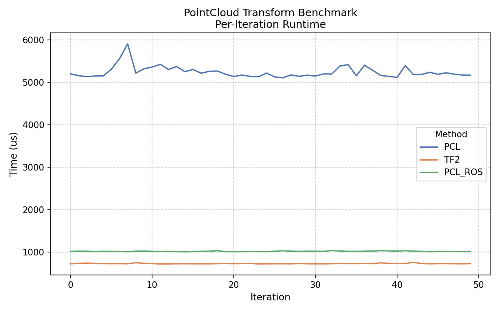

# PointCloud Transformation Benchmark

```bash
# set CORE to one of your cpu cores, I set to 3, benchmark will only use that specific core
# benchmark_repetitions is set to 50
./benchmark.sh
python3 plot_boxplot.py
python3 plot_line_graph.py
```

All the bench code is in [benchmark.cpp](src/pointcloud_transform_benchmark/src/benchmark.cpp).

**50 runs:**




As expected, if you want to transform a `sensor_msgs::msg::PointCloud2` with a `geometry_msgs::msg::TransformStamped`, it is faster to do it directly.

Converting to `pcl::PointCloud<pcl::PointXYZ>`, transforming, converting back to `sensor_msgs::msg::PointCloud2` will obviously be more costly.

Of course [`pcl::transformPointCloud(const Eigen::Matrix4f & transform, const sensor_msgs::msg::PointCloud2 & in, sensor_msgs::msg::PointCloud2 & out)`](https://github.com/ros-perception/perception_pcl/blob/67a5c2ba4c4de3ca21c5cd495812a01ced3fb69a/pcl_ros/src/transforms.cpp#L127-L227) is an option too. But it is still slower than direct tf2 way.

I don't know what was going on <https://qiita.com/yakato_jun/items/091f36308b0662110537> here but `tf2::doTransform()` is considerably faster than `pcl::transformPointCloud()`.
